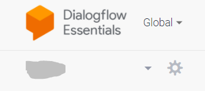
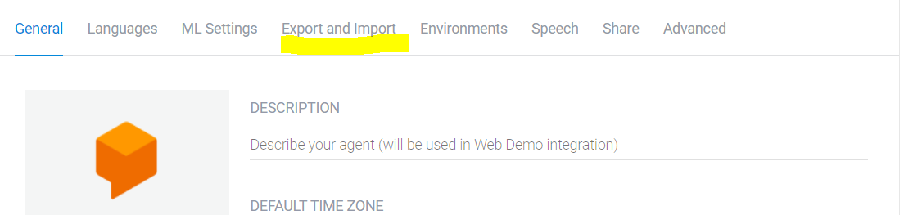
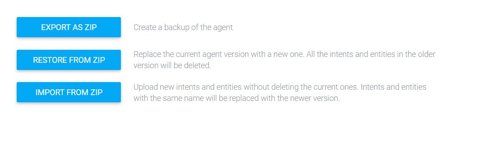
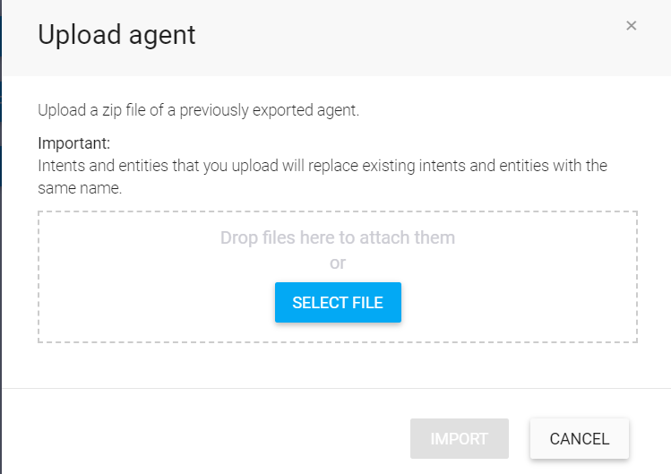

# GitHub Actions Release Management Workflow

- Supports the entire release cycle from **feature** branch to merging the code to **main** branch and creation of automatic semantic release in GitHub.
- Building the new docker image and pushing it to dockerhub with proper tagging conventions.
- Automted deployment to ECS using duplo APIs

##### Note: The release management workflows supports only Rean Foundation deployments and release only. For open source contributions, it will be extended in future.

------------

### Detailed overview of the release managment process:
1. **PR Workflow**
     
	 This is the initial step which gets triggers when a user raises Pull Request from **feature/*** branch to **develop** branch.

	 This workflow consists of the following two sections:
	 - Code Analysis - Static code analysis (ES Lint) and Security analysis (CodeQL)
	 - Validate docker build - Build docker image locally to validate the changes.

2.  **Dev Workflow**
	  This triggers when the Pull Request raised from the **feature/*** branch to **develop** branch is merged.
	  This workflow will automaticlly deploy the latest changes to ECS dev service when it is triggered.

	  This workflow consists of the following sections:
	 - Code Analysis - Static code analysis (ES Lint) and Security analysis (CodeQL)
	 - Create docker build - Build docker image as per the latest changes.
	 - Publish image to DockerHub.
	 - Deploy the build to ECS dev service (using Duplo API)

3.  **UAT Workflow**
	 This triggers when the user creates a **release/*** branch from the develop branch or pushes updates in the **release/*** branch.
	  This workflow will automaticlly deploy the latest changes to ECS UAT service when it is triggered.

	  This workflow consists of the following sections:
	 - Code Analysis - Static code analysis (ES Lint) and Security analysis (CodeQL)
	 - Create docker build - Build docker image as per the latest changes.
	 - Publish image to DockerHub.
	 - Deploy the build to ECS UAT service (using Duplo API)

4. **Release Draft Workflow**
	 This triggers when a Pull Request is raised from **release/*** branch to **main** branch.
	 It automatically drafts a new release in the GitHub with the semantic versioning of tags as per 	the **label** (major/ minor/ patch) selected at the time of creation of Pull Request. Refer [Semver](https://semver.org/).

	 This workflow consists of the following sections:
	  - Code Analysis - Static code analysis (ES Lint) and Security analysis (CodeQL)
	  - Validate docker build - Build docker image locally to validate the changes.
	  - Drafts a new release in the GitHub.

5. **Release Prod Workflow**
	 This triggers when the Pull Request raised from **release/*** branch is being merged to **main** branch.
	 It automatically publishes the last drafted  release in the GitHub with the semantic versioning of tags.
	 This workflow consists of the following sections:

	 - Code Analysis - Static code analysis (ES Lint) and Security analysis (CodeQL)
	 - Create docker build - Build docker image as per the latest changes.
	 - Publish image to DockerHub.
	 - Deploy the build to ECS Prod service (using Duplo API)
	 - Publish the latest drafted release.

	 
### How to setup NLP service?

**Below are the steps to import/export Agent in Dialogflow**

1. Click on the setting icon on the top right corner of the Dialogflow window 
  

2. Select the Export and Import option from the menu bar 
  

3. Select your action from the three given options 
    a. EXPORT AS ZIP: if you want to download agent or intent in JSON format in a zip file
    b. IMPORT FROM ZIP: if you want to load JSON format Zip file of  agent or Intents (which you are not already present in your Dialogflow ID)
    c. RESTORE FROM ZIP: if you want to load JSON format ZIP file of agent or intents (which are already present in your Dialogflow ID) to updates the changes in them 

  
4. Drop the ZIP file in the Drop section and then Type your action (IMPORT/RESTORE)  in the type box then click the import/restore button at the bottom
