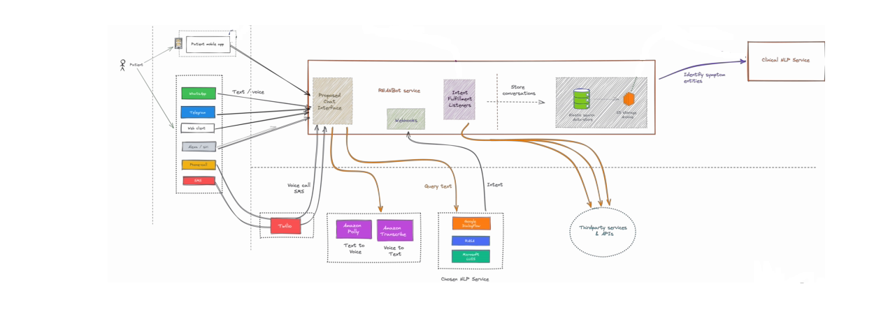

# Design considerations

The following are the goals of the current design of the system.

1. __Open architecture__ - 
   __Use default or bring your own!__ The current design supports freedom to choose individual components in multple areas. The service currently gives out-of-the-box default modules, but if somebody wants to replace the default module with their own, it is perfectly possible. The replacing modules have to support a given interface or need to be wrapped to support the interfaces. Dependency injection has been utilized to have a loose coupling between different areas of the service. The areas which currently support the replacable modules are - 
   *  __Authentication and Authorization__ - You can plugg in your own own auth service.
   *  __Database engines__ - Through basic repository interface. Default is Elasticsearch database. So the possibilities are -
      *  SQL-based (currently supported through sequelize) - e.g. MySQL, PostgreSQL, SQL server, SQLite,...
      *  NoSQL based databases such as MongoDB using Mongoose
   *  __Clinical NLP service module__ - Currently this service is not fully integrated with this code base, but the work is in progress. The service supports out-of-the-box provider plugins for [Google Healtcare Natural language API](https://cloud.google.com/healthcare/docs/concepts/nlp).

  
2. __Domain driven design with clear separation of concerns__
    * Domain specific definitions of entities
    * Code against interface
    * Testability of individual components

3. __Extensible core functionalities__ - with emphasis on customization.
   As an example, with care plan module, you can define your own care plan template around a particular patient condition. This template can be defined as a JSON file. 

# Where does REAN Health Guru Chatbot service fit?
REAN Health Guru Chatbot service is central core service which has following major responsibilities. It takes user input from different channels like Whataspp, Telegram and passes it to NLP services for fullfillment like Dialogflow, TensorFlow.
1. 

Following figure shows the current communication layout of the REAN foundation software components.
  

# Internals

The following is the flow of services requesst processing.

  1. Incoming request from channels is processed through standard set of middlewares.
  2. Client and user are authenticated.
  3. Validators and sanitizers process the request input and convert it to domain models.
  4. Controllers accept domain models and calls one or more services based on business logic.
  5. Services pass the domain models to database repository interfaces as well as to NLP interfaces.
  6. Database repository interfaces convert domain models to database models and perform relevant actions.
  7. LNP interfaces convert domain models to NLP resource format.
  8. Response is served to clien channels by services.
