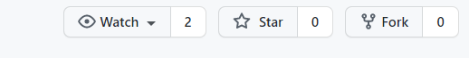

# How to setup development environment

## Technology stack
1. [Node.js](https://nodejs.org/en/) (Minimum version 12.14.1)
2. [TypeScript](https://www.typescriptlang.org/) (Minimum version 4.2.4)
3. [Elastic Search](https://www.elastic.co/downloads/elasticsearch)

## Development machine set-up

* Clone this repository
  
  `clone git@github.com:REAN-Foundation/rean-health-guru-bot.git <your-local-folder>`

  or
  fork the repository
  

* Install all the prerequisites as listed in [technology stack](#technology-stack).
* Open the root directory of the folder where you have cloned/forked the repository in Visual Studio Code.
* Go to terminal of VSCode and type `npm install`. This will install all the dependency packages.
* Open <your-root-folder>/.env.sample file and change the name to .env. Update the environment variables in .env file to the ones which are available on your machine.
* Debug mode: 
  * Make sure you have <your-root-folder>/.vscode/launch.json file available.
  * Click on debug button on left panel and you should see 'Launch Program' option against 'RUN AND DEBUG' label.
  * Click on 'Play' button against 'Launch Program' to start the service in debug mode.
* Normal mode: 
  * To start service in regular mode, go to the terminal and run `npm start`.
* You should be able to see server start messages.
* Congratulations, your local REAN Health Guru Bot service is up and running!
